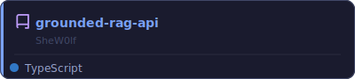
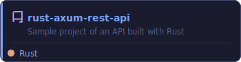

<div align="center">

[](https://git.io/typing-svg)

</div>

<br>

```ts
const SheW0lf = {
  role: "Software Engineer",
  stack: [
    "TypeScript",
    "React",
    "React Native",
    "Rust",
    "Ruby",
    "Python",
    "Node",
  ],
  currentlyPlaying: ["Elden Ring", "Enshrouded", "Divinity Original Sin 2"],
  loves: ["Open World RPGs", "Survival Sandbox", "Late night coding sessions"],
};
```

<br>

## 💜 RECENT PROJECTS

<div align="center">

<a href="https://github.com/SheW0lf/grounded-rag-api"></a><a href="https://github.com/SheW0lf/rust-axum-rest-api"></a>

</div>

<br>

## 💜 CONTRIBUTION GRID

<!-- Requires GitHub Action setup with Platane/snk — see setup notes -->


<br>

## 💜 STATS

<div align="center">

[](https://github.com/SheW0lf)

</div>

<br>

<div align="center">


</div>
